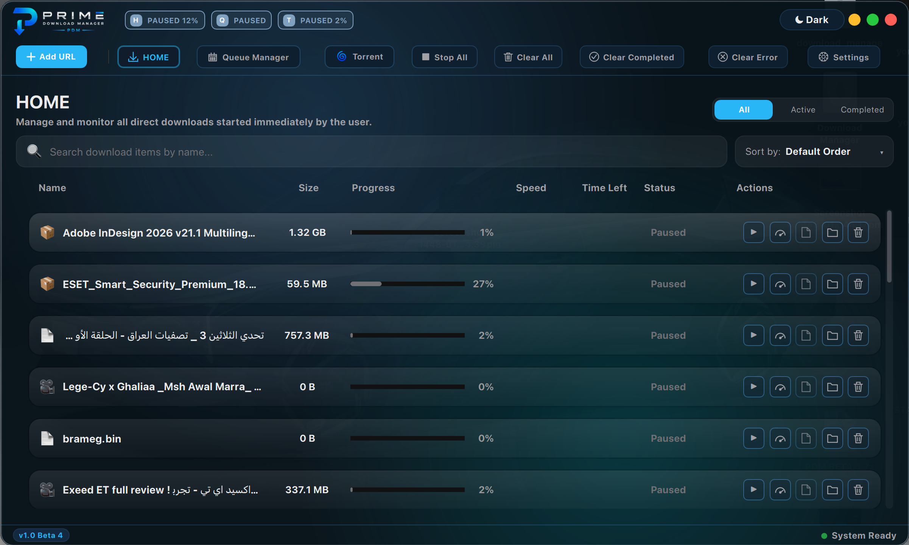
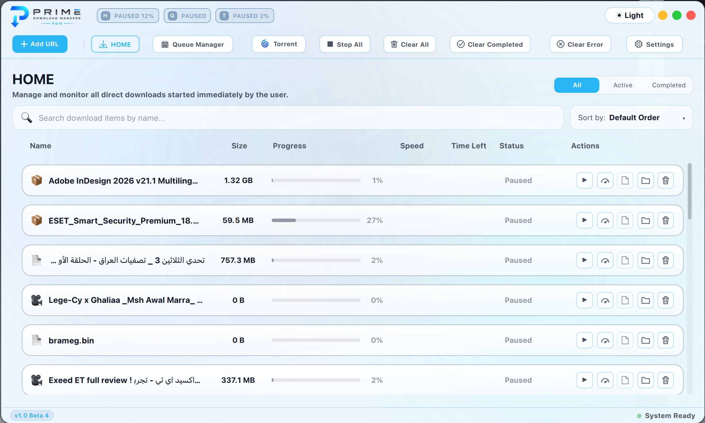
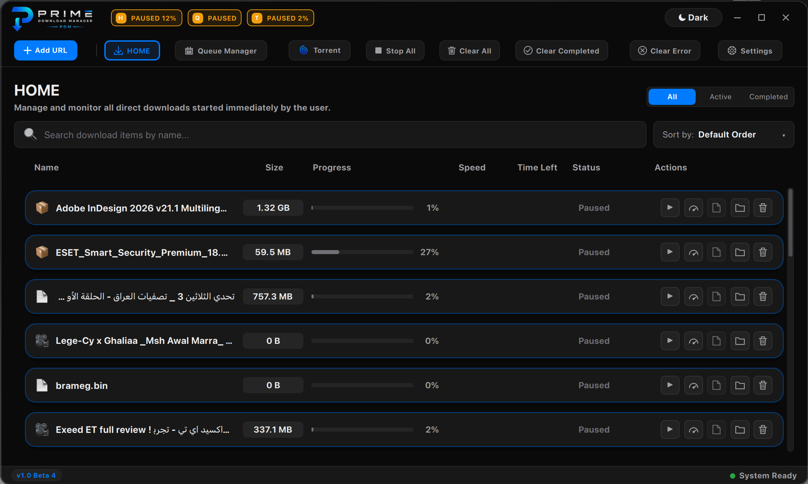
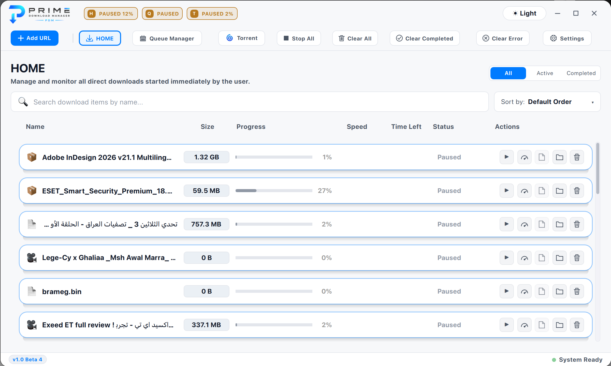
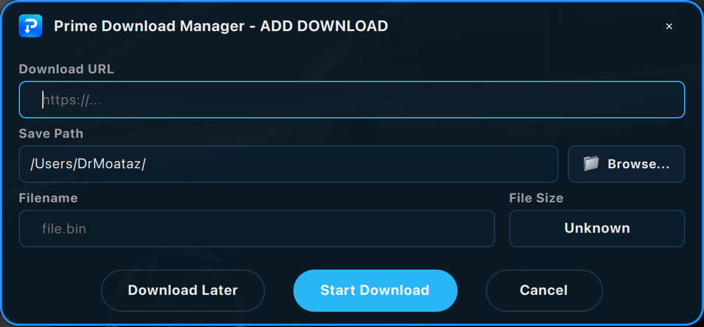
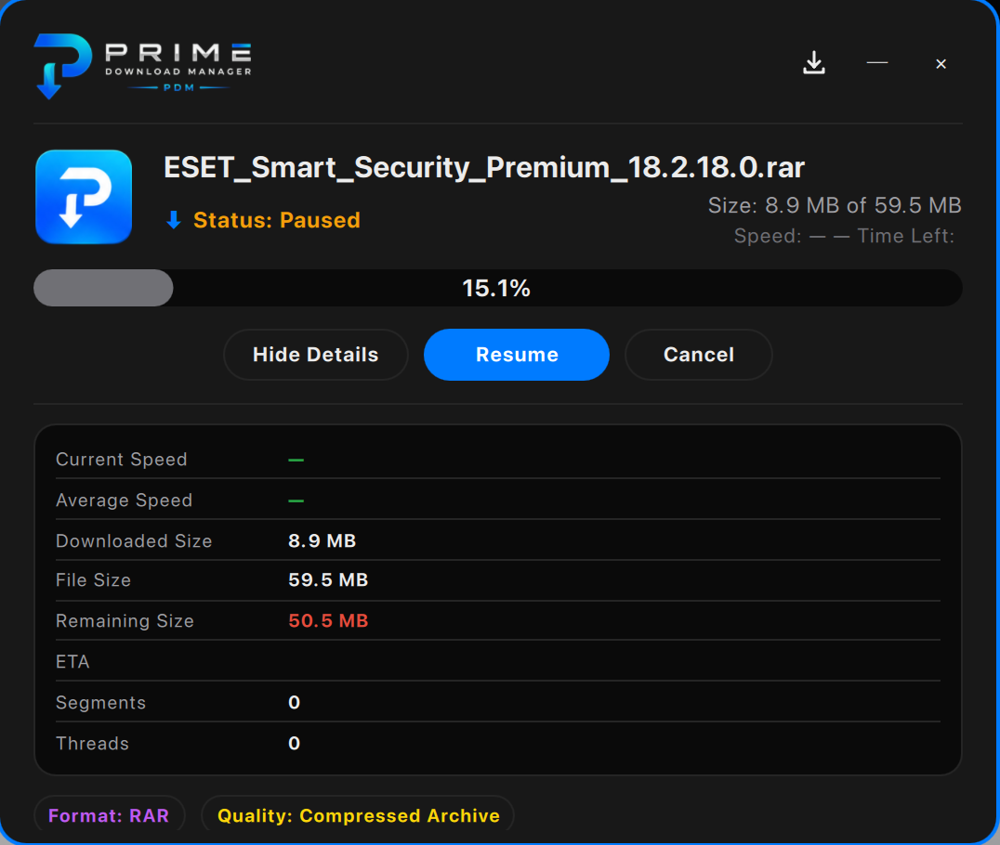
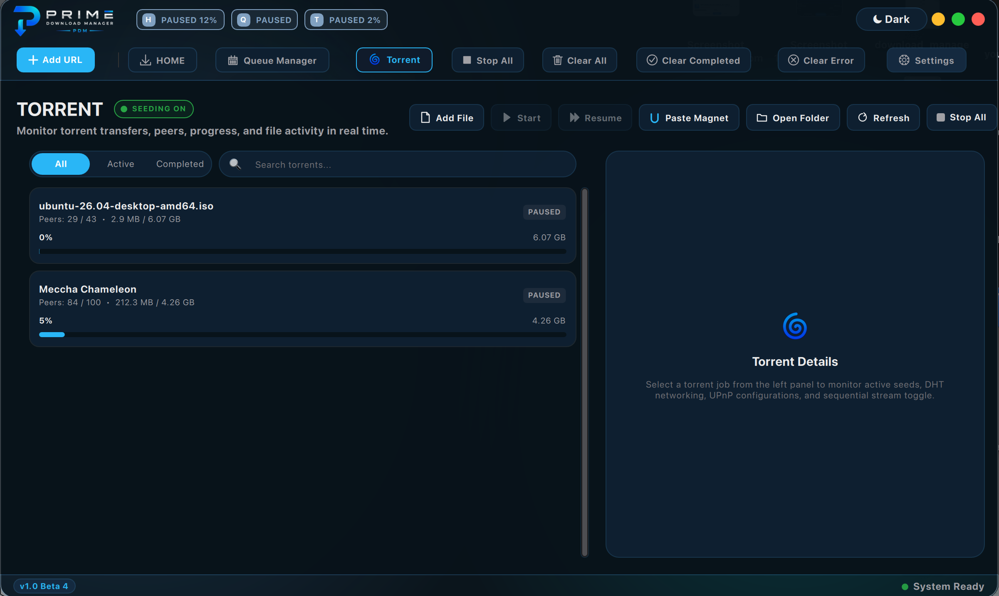
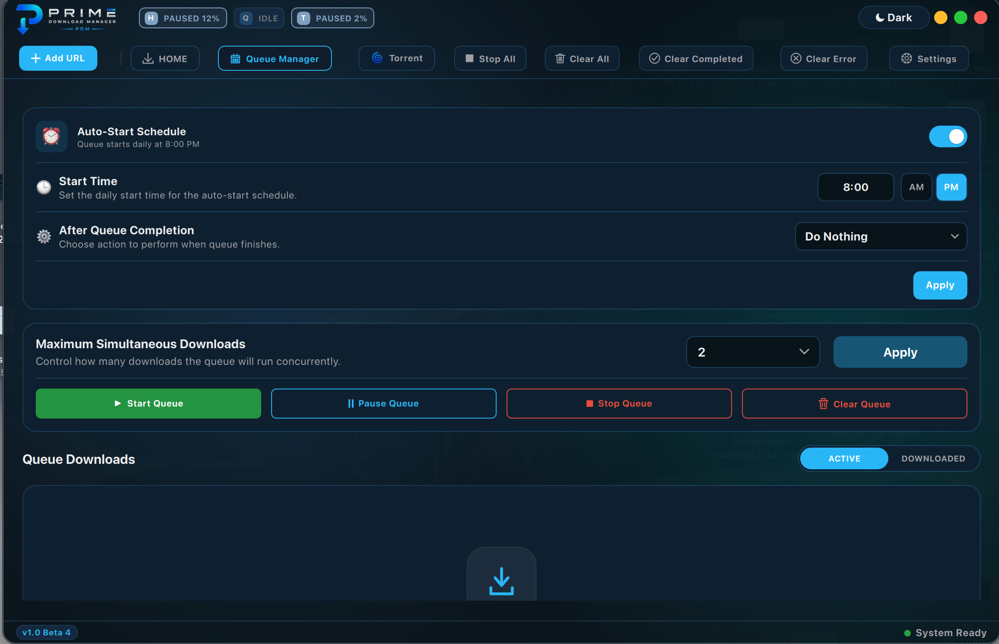

# Prime Download Manager (PDM)

### The fast, modern download manager for Windows

Multi-connection acceleration · Video & playlist downloads · Torrents · Browser integration · Stunning Glass & Classic themes

&nbsp;

&nbsp;

 

---

## What is Prime Download Manager?

**Prime Download Manager (PDM)** is a desktop download accelerator that takes over and speeds up every download on your PC. It splits each file into multiple simultaneous connections for maximum speed, catches downloads straight from your browser, grabs videos and whole playlists, handles torrents, and keeps everything organized in clean queues — all wrapped in a polished interface with beautiful **Glass** and **Classic** themes.

> **PDM is free to use.** Just download the installer below and you're ready to go.

### [📥 Download the latest version](https://github.com/Emizo59/Prime-Download-Manager/releases/latest/download/Prime_Download_Manager_Setup.exe)

---

## ✨ Features

| | |
|---|---|
| ⚡ **Accelerated downloads** | A multi-connection engine downloads each file in parallel segments for the fastest possible speed — with pause, resume, and automatic reconnect. |
| 🎬 **Video & playlists** | Download videos and entire playlists from thousands of sites, pick the quality you want, and PDM merges audio + video automatically. |
| 🧲 **Torrents** | Built-in torrent and magnet-link support — manage your torrents right alongside your other downloads. |
| 🌐 **Browser integration** | One-click capture from **Chrome, Edge, Brave, and Opera**. PDM quietly takes over downloads the moment you start them. |
| 🗂️ **Queues & scheduling** | Group downloads into queues, schedule start/stop times, set retry limits, and choose what happens when a queue finishes. |
| 🎨 **Glass & Classic themes** | Switch between a frosted **Glass** look and a crisp **Classic** look — each in **Light** and **Dark**, with multiple color presets. |
| 🔁 **Smart duplicate detection** | PDM notices when you've already downloaded a file and lets you re-download, open it, or skip. |
| 🔒 **Private by design** | Any credentials are encrypted on your own device. Nothing is ever sent to third parties. |

---

## 🖼️ Screenshots

**Glass theme — Dark & Light**

**Classic theme — Dark & Light**

**Add a download &nbsp;·&nbsp; Live progress with details**

**Torrents &nbsp;·&nbsp; Queue manager**

---

## 🚀 Getting started

1. **[Download the installer](https://github.com/Emizo59/Prime-Download-Manager/releases/latest/download/Prime_Download_Manager_Setup.exe)** (`Prime_Download_Manager_Setup.exe`).
2. Run it and follow the setup wizard.
3. When prompted, enable **Browser Integration** so PDM can automatically catch your downloads.
4. Start downloading — PDM takes it from there. 🎉

> **System requirements:** Windows 10 or 11 (64-bit).

---

## 🆕 What's new in 1.0

- 🎬 **YouTube Section Downloading**: High-stability time range cutting directly from YouTube with dynamic client headers (`ios,web,android`) to bypass blocks, plus automated resume conflicts resolution and process crash protection.
- 🎨 **Digital Timer Input UI**: Elegant unified time capsule display (From: 00:00 ➔ To: 00:10) for clipping video sections cleanly without text truncation.
- 🌐 **Facebook Video Downloader**: Repositioned the in-browser video download button to the top-right corner to prevent blocking the video player's default volume slider.
- 🔁 **Smart duplicate detection**: Updated duplicate checks to match both filename and save path. Prevented overwrites and implemented sequential numbering using parentheses (e.g. `A (1).ext`).
- 🛡️ **Security & performance rollback**: Reverted codebase features to stable build `2026062319` for maximum performance, reliability, and security.

### 🐞 Recently fixed
- Fixed YouTube video section download connection blocks and 403 Forbidden errors.
- Fixed file replacements when downloading identical URLs.
- Fixed updater and installer compatibility issues.
- Fixed playlist queue display and download integrity.

See all releases on the **[Releases page](https://github.com/Emizo59/Prime-Download-Manager/releases)**.

---

## ❓ FAQ

**Is it free?**
Yes — download and use it for free.

**Which browsers are supported?**
Chrome, Edge, Brave, and Opera via the official browser integration.

**Does it work on macOS?**
A macOS build is in the works. Windows is fully supported today.

**Where are my files saved?**
Wherever you choose — set a default download folder in **Settings**, or pick a path per download.

---

### Developed By **Dr. Moataz**

 &nbsp; 

© 2026 Prime Download Manager (PDM). All rights reserved.

